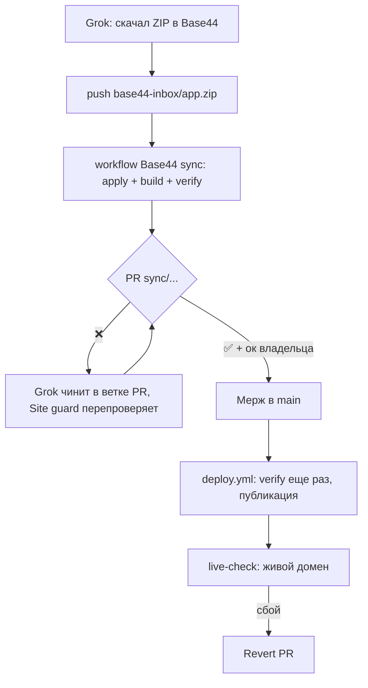

# Grok-агент обновлений из Base44

Промпт для агента — [prompt.md](prompt.md). Вставляется целиком в инструкцию задачи Grok.

## Схема

## Что настроить один раз

1. **Задача в Grok.** Вставить prompt.md, включить браузер и расписание (ежедневно 10:00 МСК).
2. **Base44.** Войти под своей учёткой в браузере Grok (или положить логин и пароль в секреты задачи). Коды 2FA агент будет спрашивать в чате.
3. **GitHub.** Дать Grok доступ на запись к репозиториям:
   - `katrinvlasova0-coder/shvarts_chorny`, `katrinvlasova0-coder/shvarts-therapist`, `katrinvlasova0-coder/psyty`, `katrinvlasova0-coder/rusalen-center`;
   - `shvartsblack-koder/shvarts_black`, `shvartsblack-koder/rusalen`.
4. **В каждом репозитории** (уже сделано скриптом, если PR с site-guard смержен):
   - ветка `base44-inbox`;
   - Settings → Actions → General → Workflow permissions: включено «Allow GitHub Actions to create and approve pull requests»;
   - секрет `VITE_LEADS_WEBHOOK_URL` для `rusalen` и `psyty` (уже есть, им пользуется деплой).

## Проверки

Всё проверяет `site-guard/guard.mjs` (см. [site-guard/README.md](../../site-guard/README.md)) — в трёх местах: в PR, перед публикацией и на живом домене после неё.
